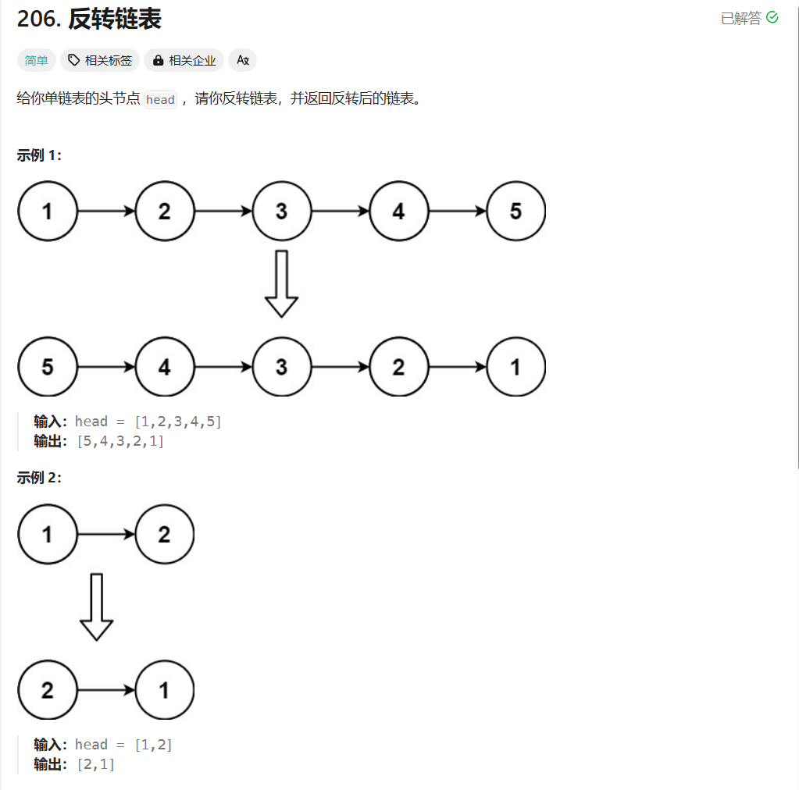
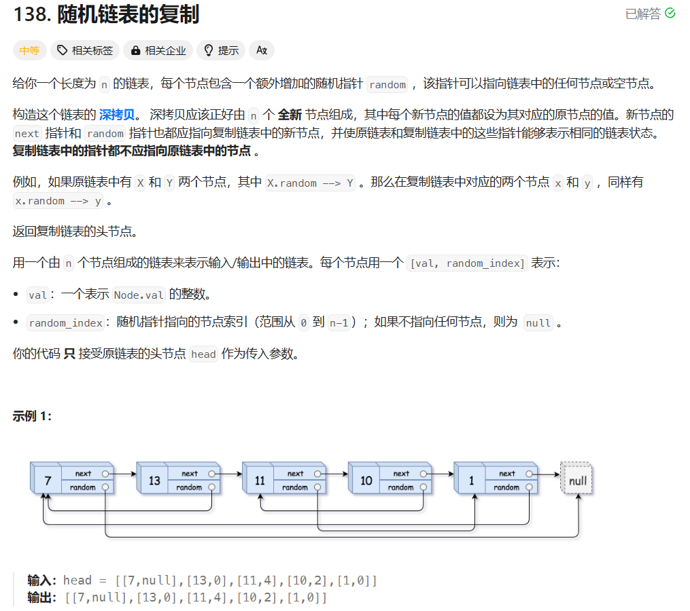

# LeetCode hot100


## 1 哈希

### 1.1 两数之和


使用哈希表记录已经访问过的数值`nums[i]`和下标`i`的映射关系，每新访问一个数值，就在哈希表中查询是否存在与其相加和为`target`的记录。

```c++
class Solution {
public:
    vector<int> twoSum(vector<int>& nums, int target) {
        unordered_map<int, int> map;
        for (int i = 0; i < nums.size(); i++){
            // 查看是否遍历过目标值
            auto t = map.find(target - nums[i]);
            if(t != map.end()){
                return {t->second, i};
            }
            map.insert({nums[i], i});
        }
        return {};
    }
};
```

> `unordered_map`常见用法（后续补充）

1. `find`：返回一个迭代器，指向查找到的元素。如果指定的键不存在，`find`函数返回的迭代器等于`end()`

```c++
#include <iostream>
#include <unordered_map>

int main() {
    std::unordered_map<int, std::string> my_map = {
        {1, "one"},
        {2, "two"},
        {3, "three"}
    };

    auto it = my_map.find(2);
    if (it != my_map.end()) {
        std::cout << "The value of key 2 is " << it->second << std::endl;
    } else {
        std::cout << "Key 2 not found" << std::endl;
    }

    it = my_map.find(4);
    if (it != my_map.end()) {
        std::cout << "The value of key 4 is " << it->second << std::endl;
    } else {
        std::cout << "Key 4 not found" << std::endl;
    }

    return 0;
}

```

运行上面的程序，输出结果为

```
The value of key 2 is two
Key 4 not found
```

2. `count`：返回值为找到的元素的个数

在`unordered_map`中，存在元素则返回`1`，反之，返回`0`

```c++
 unordered_map<int,int> map;
 map[0]=1;
 if((map.count(0))
 printf("这个map中含有键为1的键值对");
```


### 1.2 字母异位词分组


将字符串按照字典序排序之后的结果作为索引，并将该索引对应一个记录具有相同索引的字符串数组。

```c++
class Solution {
public:
    vector<vector<string>> groupAnagrams(vector<string>& strs) {
        
        unordered_map<string, vector<string>> map;
        for(auto str: strs){
            string tmp = str;
            // 对str升序排序，获取对应的索引
            sort(tmp.begin(), tmp.end());
            // 在索引对应的字符串数组中增加该str
            map[tmp].push_back(str);
        }

        vector<vector<string>> ans;
        for(auto kk = map.begin(); kk != map.end(); kk++){
            ans.push_back(kk->second);
        }

        return ans;
    }
};
```

> `sort`的使用

需要头文件`#include <algorithm>`

默认排序为升序，可以自定义比较函数，例如，按照下面的方法可以实现对`a`降序排序：

```c++
bool cmp(int x, int y){
    return x > y;
}

sort(a.begin(), a.end(), cmp);

// 或者下面这种方式
sort(a.begin(), a.end(), greater<int>());
```


### 1.3 最长连续序列


> 官方题解

利用`unordered_set`对原`nums`数组进行去重，然后遍历所有情况

进行的剪枝操作：只有当前元素是连续序列的第一个值才进行往后遍历，使得每个元素最多遍历一次

```c++
class Solution {
public:
    int longestConsecutive(vector<int>& nums) {
        // 构建num_set，进行去重
        unordered_set<int> num_set;
        for (const int& num : nums) {
            num_set.insert(num);
        }

        int longestStreak = 0;

        for (const int& num : num_set) {
            // 判断该num是否为上升序列的第一个元素，从而保证每个元素只遍历一次
            if (!num_set.count(num - 1)) {
                int currentNum = num;
                int currentStreak = 1;

                while (num_set.count(currentNum + 1)) {
                    currentNum += 1;
                    currentStreak += 1;
                }

                longestStreak = max(longestStreak, currentStreak);
            }
        }

        return longestStreak;           
    }
};
```

> 个人思路

对原数组进行排序，并去重

依次遍历所有元素，获得最大长度

```c++
class Solution {
public:   
    int longestConsecutive(vector<int>& nums) {
        if(nums.size() == 0) return 0;
        // 对原数组进行排序
        sort(nums.begin(), nums.end());
        // 去重
        vector<int> new_nums;
        for(int i = 0; i < nums.size(); i++){
            if(!i || nums[i] != nums[i - 1])
                new_nums.push_back(nums[i]);
        }

        // 依次遍历所有元素
        int ans = 1, ans_cur = 1;
        for(int i = 1; i < new_nums.size(); i++){
            if(new_nums[i] == new_nums[i - 1] + 1){
                ans_cur++;
            }
            else{
                ans = max(ans, ans_cur);
                ans_cur = 1;
            }
        }
        ans = max(ans, ans_cur);
        return ans;
    }
};
```


## 2 双指针

### 2.1 移动零


利用快慢指针，对于快指针而言：

+ 遇到`0`，跳过
+ 遇到非`0`，将该值记录到慢指针所指下标位置，慢指针移动一位

```c++
class Solution {
public:
    void moveZeroes(vector<int>& nums) {
        // 利用快慢指针进行赋值
        int sp = 0; 
        for(int fp = 0; fp < nums.size(); fp++){
            // 非零则记录，零则跳过
            if(nums[fp]){
                nums[sp++] = nums[fp];
            }
        }
       // 将慢指针后续的位置全置为0
        while(sp < nums.size())
            nums[sp++] = 0;
        return;
    }
};
```


### 2.2 盛水最多的容器


左右指针`l, r`位于数组的左右两端，依次移动对应高度较小的指针（`l++`或者`r--`），并记录每次移动后的容积，直到两个指针相遇。

感觉这个思路有贪心的思想，因为若移动高度较高的指针，移动后的面积肯定小于移动前的面积，但如果移动高度较小的指针，移动后的面积可能增加。

```c++
class Solution {
public:
    int maxArea(vector<int>& height) {
        int l = 0, r = height.size() - 1;
        int res = 0;
        // 循环直到两个指针相遇
        while(l < r){
            // 计算当前容器面积，更新res
            res = max(res, min(height[l], height[r]) * (r - l));
            // 移动对应高度较小的指针
            if(height[l] < height[r])   
                l++;
            else
                r--;
        }
        return res;
    }
};
```


### 2.3 接雨水


> 双指针法

按列计算每个宽度为1的底能接多少雨水

从图中可以看出，每列的雨水高度取决于该列左边最高的柱子和右边最高柱子的高度的最小值。

```c++
class Solution {
public:
    int trap(vector<int>& height) {
        if(height.size() <= 2) return 0;
        // maxLeft[i]表示下标i左边（包括本身）的最大高度
        vector<int> maxLeft(height.size(), 0);
        // maxRight[i]表示下标i右边（包括本身）的最大高度
        vector<int> maxRight(height.size(), 0);

        maxLeft[0] = height[0];
        for(int i = 1; i < height.size(); i++)
            maxLeft[i] = max(maxLeft[i - 1], height[i]);

        maxRight[height.size() - 1] = height[height.size() - 1];
        for(int i = height.size() - 2; i >= 0; i--)
            maxRight[i] = max(maxRight[i + 1], height[i]);

        int res = 0;
        for(int i = 0; i < height.size(); i++){
            int curHeight = min(maxLeft[i], maxRight[i]);
            // 这个判断删去也可以，因为统计最大高度时包括了本身
            // 加0对最终的结果也没有影响
            if(curHeight > height[i]){
                res += curHeight - height[i];
            }
        }
        return res;
    }
};
```

> 单调栈法


维护一个从栈顶到栈底是严格递增的单调栈

+ 遇到小于栈顶元素高度的元素时，将该元素入栈，因为需要大于等于才能接雨水

  ```c++
  if(height[i] < height[st.top()]) st.push(i);
  ```

+ 遇到等于栈顶元素高度的元素时，替换栈顶元素，例如两个连着的高为2的柱子，在计算雨水体积时，需要用靠右的柱子

  ```c++
  if(height[i] == height[st.top()]){
      st.pop();
      st.push(i);
  }
  ```

+ 遇到大于栈顶元素高度的元素时，弹出栈顶元素，该元素为接雨水凹槽的底，此时剩余的栈顶元素为接雨水凹槽的左边界

  ```c++
  // while循坏，需要持续计算
  while(!st.empty() && height[i] >= height[st.top()]){
      int mid = st.top();
      st.pop();
      if(!st.empty()){
          int h = min(height[i], height[st.top()]) - height[mid];
          // 注意减1，因为需要求左右边界中间的宽度
          int w = i - st.top() - 1;
          res += h * w;
      }
  }
  st.push(i);
  ```

整合后的代码：

```c++
class Solution {
public:
    int trap(vector<int>& height) {
        stack<int> st;
        int res = 0;
        for(int i = 0; i < height.size(); i++){
            while(!st.empty() && height[i] >= height[st.top()]){
                int mid = st.top();
                st.pop();
                if(!st.empty()){
                    int h = min(height[i], height[st.top()]) - height[mid];
                    int w = i - st.top() - 1;
                    res += h * w;
                }
            }
            st.push(i);
        }
        return res;
    }
};
```


## 3 滑动窗口

### 3.1 无重复字符串的最长子串


> 个人思路

用`unordered_map`记录对应字符上一次出现的位置，若新加入的字符在之前出现过，则更新窗口左端点的位置。

```c++
class Solution {
public:
    int lengthOfLongestSubstring(string s) {
        // map用于记录s[i]以及其上一次出现的位置的下标
        unordered_map<char, int> map;
        // res记录最终答案，cur_res记录当前窗口长度
        int res = 0, cur_res = 0;
        for(int i = 0; i < s.size(); i++){
            // 若s[i]之前未出现，则将s[i]移动进窗口
            if(map.find(s[i]) == map.end()){
                // 当前窗口长度 +1
                cur_res++;
                map[s[i]] = i;
            }
            // 若s[i]之前出现过
            else{
                // 窗口需要更新，更新res
                res = max(res, cur_res);
                // 若s[i]上一次出现的位置不在当前窗口内，则 cur_res += 1
                // 若s[i]上一次出现的位置不在当前窗口内，则 cur_res = i - map[s[i]]
                // 那么如何判断s[i]上一次出现是否在窗口内呢？对上述两式取min即可
                cur_res = min(cur_res + 1, i - map[s[i]]);
                // 并对map[s[i]]进行更新
                map[s[i]] = i;
            }
        }
        res = max(res, cur_res);
        return res;
    }
};
```

> 官方题解

个人思路里面对更新`cur_res`的思路有点绕，我也是样例出现报错才发现需要对`s[i]`上一次出现是否在窗口内进行特判。

官方题解的思路就比较常规，用`unodered_set`来记录在窗口中的字符

```c++
class Solution {
public:
    int lengthOfLongestSubstring(string s) {
        // 哈希集合，记录每个字符是否出现过
        unordered_set<char> occ;
        int n = s.size();
        // 右指针，初始值为 -1，相当于我们在字符串的左边界的左侧，还没有开始移动
        int rk = -1, ans = 0;
        // 枚举左指针的位置，初始值隐性地表示为 -1
        for (int i = 0; i < n; ++i) {
            if (i != 0) {
                // 左指针向右移动一格，移除一个字符
                occ.erase(s[i - 1]);
            }
            // 只要下一个元素未在窗口中出现，就将该元素加入窗口
            while (rk + 1 < n && !occ.count(s[rk + 1])) {
                occ.insert(s[rk + 1]);
                ++rk;
            }
            // 第 i 到 rk 个字符是一个极长的无重复字符子串
            ans = max(ans, rk - i + 1);
        }
        return ans;
    }
};
```


### 3.2 找到字符串中所有字母异位词


统计出字符串`p`中各个字符的出现次数

在字符串`s`中取与字符串`p`相同长度的窗口，移动窗口，并统计窗口中各个字符出现的次数，并与字符串`p`中各个字符出现的次数作比较

```c++
class Solution {
public:
    // 词频比较函数
    bool cmpstr(int a[26], int b[26]){
        for(int i = 0; i < 26; i++){
            if(a[i] != b[i]) return false;
        }
        return true;
    }
    
    vector<int> findAnagrams(string s, string p) {
        vector<int> res;

        if(s.size() < p.size()) return res;

        // 因为题中只含有小写字母，所以用长度为26的数组做词频统计
        int countp[26] = {0};
        int counts[26] = {0};
        for(int i = 0; i < p.size(); i++){
            countp[p[i] - 'a']++;
        }

        int len = p.size(), lens = s.size();
        int l = 0, r = -1;
        // 移动窗口右端点
        while(r < lens - 1){
            r++;
            counts[s[r] - 'a']++;
            // 保证窗口长度等于字符串p的长度
            if(r - l + 1 > len){
                counts[s[l] - 'a']--;
                l++;
            }
            if(r - l + 1 == len)
                if(cmpstr(countp, counts))
                    res.push_back(l);
        }
        return res;
    }
};
```


## 4 子串

### 4.1 和为K的子数组


**子数组是数组中元素的连续非空序列**

+ 首先尝试了暴力枚举（超时）
+ 因为是计算连续元素的和，想到用**前缀和**，利用前缀和之后可以ac，但是耗时较长
+ 最终思路：**前缀和+哈希表**

哈希表为不同前缀和的数值与出现次数的映射，但这个方法需要保证每次只在该数之前的前缀和中搜索（边遍历边计算）：

假设`nums[1] ~ nums[6]`和`nums[1] ~ nums[9]`的前缀和都为`5`，而`nums[1] ~ nums[8]`前缀和为`8`，`target`为`3`：

+ 如果先遍历一边统计完所有的前缀和数值以及出现次数，前缀和为`5`出现了2次。在第二次遍历到`nums[8]`时，会将`res += 2`，但实际上`nums[8] ~ nums[9]`的和为`-3`，并不符合题意

```c++
class Solution {
public:
    int subarraySum(vector<int>& nums, int k) {
        // 用前缀和+哈希表进行优化，这个方法必须保证每次只在该数之前的前缀和中搜索
        // map: 前缀和数值 --> 出现次数
        unordered_map<int, int> map;
        // 前缀和为0先初始化为1，使得第一个元素可以参与求和
        map[0] = 1;

        int res = 0;
        int pre = 0;
        for(int i = 1; i <= nums.size(); i++){
            pre += nums[i - 1];
            int target = pre - k;
            // 查看目标前缀和是否出现过
            if(map.find(target) != map.end()){
                res += map[target];
            }
            map[pre]++;
        }
        return res;
    }
};
```


### 4.2 滑动窗口最大值


**这是单调队列的一道典型题！！！！**

通过代码理解滑动窗口的思路：

```c++
class Solution {
public:
    vector<int> maxSlidingWindow(vector<int>& nums, int k) {
        vector<int> result;
        // 需要一个双向队列来维护从队头到队尾单调非严格单调递减的单调队列
        deque<int> dq;
        // 将前k个元素进行对应的入队操作
        for(int i = 0; i < k; i++){
            while(!dq.empty() && nums[dq.back()] <= nums[i]){
                dq.pop_back();
            }
            dq.push_back(i);
        }

        for(int i = k; i < nums.size(); i++){
            result.push_back(nums[dq.front()]);
            
            // 判断是否有元素需要出队
            if(dq.front() < i - k + 1){
                dq.pop_front();
            }

            // 元素入队
            while(!dq.empty() && nums[dq.back()] <= nums[i]){
                dq.pop_back();
            }
            dq.push_back(i);
        }
        result.push_back(nums[dq.front()]);

        return result;
    }
};
```


### 4.3 最小覆盖子串


+ `i`作为窗口右端点，每次循环向右移动一位
+ `j`作为窗口的左端点，出现冗余字符串时，向右移动

```c++
class Solution {
public:
    string minWindow(string s, string t) {
        // cntt 统计t中字符出现次数
        // snts 统计s的当前窗口中字符出现的次数
        unordered_map<char, int> cntt, cnts;
        
        for(int i = 0; i < t.size(); i++){
            cntt[t[i]]++;
        }

        string ans = "";

        // i为窗口右端点，每次循环向右移动一步
        // j为窗口左端点
        // cnt记录窗口中有效字符出现的次数
        for(int i = 0, j = 0, cnt = 0; i < s.size(); i++){
            // 添加当前字符，更新有效字符数量
            cnts[s[i]]++;
            if(cnts[s[i]] <= cntt[s[i]]) cnt++;

            // j向右移动，去除冗余字符
            while(cnts[s[j]] > cntt[s[j]]){
                cnts[s[j]]--, j++;
            }
            
			// 如果当前窗口已经完全覆盖t，更新ans
            if(cnt == t.size()){
                if(ans == "" || ans.size() > i - j + 1){
                    ans = s.substr(j, i - j + 1);
                }
            }
        }

        return ans;
    }
};
```

> 上述代码中存在一个问题，`unordered_map`访问未出现的`key`会出现什么情况：

```c++
unordered_map<string, int> mymap1;  
auto val = mymap1["str"]; // val为0   

// 常用于词频统计，存在则加一，不存在则创建后赋值为1 
unordered_map<string, int> mymap2;  
mymap2["str"]++; // mymap2["str"] = 1   
```

Map中使用方括号访问键对应的值`map[key]`时：

+ 若该`key`存在，则访问取得`value`值；

+ 若该`key`不存在，访问仍然成功，取得`value`对象默认构造的值。具体如下：

  用` []`访问，但`key`不存在时，**C++会利用该`key`及默认构造的`value`，组成`{key，value}`对，插入到`map`中**。

  `value`为 `string`对象，则构造空串；`value`为`int`对象，构造为`0`。

注：因此在访问`map`元素时，应先用`map.find`查找该元素，找到后再访问。 同时，用法`mymap2["str"]++;`常用于词频统计，存在则加一，不存在则创建后赋值为`1`。


## 5 普通数组


### 5.1 最大子数组和


> 动态规划（第一反应的思路）

`dp[i]`表示以`nums[i]`结尾的最大连续子数组的和

+ 若`dp[i - 1] < 0`，则需要从`nums[i]`开始的新的子数组，`dp[i] = nums[i]`
+ 若`dp[i - 1] > 0`，则可以将`nums[i]`接在之前的子数组后面，即`dp[i] = dp[i - 1] + nums[i]`

```c++
class Solution {
public:
    int maxSubArray(vector<int>& nums) {    
        vector<int> dp(nums.size(), 0);

        dp[0] = nums[0];
        int result = dp[0];

        for(int i = 1; i < nums.size(); i++){
            dp[i] = max(dp[i - 1], 0) + nums[i];
            if(dp[i] > result){
                result = dp[i];
            }
        }
        return result;
    }
};
```


> 前缀和（来自灵茶山艾府）

由于数组的元素和等于两个前缀和的差，所以求出`nums`的前缀和，通过一次遍历，每次都减去之前遍历过的最小的前缀和即可知道以`nums[i]`结尾的子数组的最大和

```c++
class Solution {
public:
    int maxSubArray(vector<int>& nums) {
        int ans = INT_MIN;
        int min_prefixSum = 0, prefixSum = 0;
        for(int i = 0; i < nums.size(); i++){
            prefixSum += nums[i];
            ans = max(ans, prefixSum - min_prefixSum);
            min_prefixSum = min(prefixSum, min_prefixSum);
        }
        return ans;
    }
};
```


> 分治（力扣官方题解）

定义一个操作`get(a, l, r)`表示查询`a`序列`[l, r]`区间内的最大子段和，那么最终求的答案就应该是`get(nums, 0, nums.size() - 1)`。

对区间`[l, r]`进行分治求解，分为两个区间`[l, mid]`（左子区间）和`[mid + 1, r]`（右子区间），其中`mid = (l + r) >> 1`。分治不断向下递归到区间长度为1时，向上返回。

在整个分治过程中，需要维护以下四个量：

+ `lSum`：区间`[l, r]`内以`l`为左端点的最大子段和 

  --> {左子区间的`lSum`} 与 {左子区间的`iSum`和右子区间的`lSum`的和} 的最大值

+ `rSum`：区间`[l, r]`内以`r`为右端点的最大子段和

  --> {右子区间的`rSum`} 与 {右子区间的`iSum`和左子区间的`rSum`的和} 的最大值

+ `mSum`：区间`[l, r]`的最大子段和

  --> {左子区间的`mSum`} 与 {右子区间的`mSum`} 与 {左子区间的`rSum`和右子区间的`lSum`的和} 的最大值

+ `iSum`：区间`[l, r]`的和

  --> {左子区间的`iSum`} + {右子区间的`iSum`}

```c++
class Solution {
public:
    struct Status {
        int lSum, rSum, mSum, iSum;
    };

    Status pushUp(Status l, Status r) {
        int iSum = l.iSum + r.iSum;
        int lSum = max(l.lSum, l.iSum + r.lSum);
        int rSum = max(r.rSum, r.iSum + l.rSum);
        int mSum = max(max(l.mSum, r.mSum), l.rSum + r.lSum);
        return (Status) {lSum, rSum, mSum, iSum};
    };

    Status get(vector<int> &a, int l, int r) {
        if (l == r) {
            return (Status) {a[l], a[l], a[l], a[l]};
        }
        int m = (l + r) >> 1;
        Status lSub = get(a, l, m);
        Status rSub = get(a, m + 1, r);
        return pushUp(lSub, rSub);
    }

    int maxSubArray(vector<int>& nums) {
        return get(nums, 0, nums.size() - 1).mSum;
    }
};
```


### 5.2 合并区间


```c++
class Solution {
public:
    vector<vector<int>> merge(vector<vector<int>>& intervals) {
        vector<vector<int>> result;
        // 将区间按照左端点从小到大排序
        sort(intervals.begin(), intervals.end());
        // l, r分别记录当前维护的区间的左右端点
        int l = intervals[0][0], r = intervals[0][1];
        for(int i = 1; i < intervals.size(); i++){
            int cur_l = intervals[i][0], cur_r = intervals[i][1];
            // 当前区间与所维护的区间有交集
            if(cur_l <= r){
                // 更新当前需维护的区间的右端点
                r = max(cur_r, r);
            }
            // 当前区间与所维护的区间之间没有交集
            else{
                // 当前维护的区间加入结果集
                result.push_back({l, r});
				// 当前区间更新成需要维护的区间
                l = cur_l, r = cur_r;
            }
        }
        // 别忘了把最后维护的区间加入结果集
        result.push_back({l, r});

        return result;
    }
};
```


### 5.3 轮转数组


> 直接映射

这个思路比较常规，但需要额外申请数组

```c++
class Solution {
public:
    void rotate(vector<int>& nums, int k) {
        int n = nums.size();
        vector<int> result(n, 0);
        for(int i = 0; i < n; i++){
            result[(i + k) % n] = nums[i];
        }
        nums = result;
    }
};
```


> 分段逆序

这个思路感觉比较巧妙，直接拿一个例子做一遍就可以理解。

```c++
class Solution {
public:
    // 逆序函数
    void reverse(vector<int>& nums, int l, int r){
        while(l < r){
            swap(nums[l], nums[r]);
            l++, r--;
        }
    }
    
    void rotate(vector<int>& nums, int k) {
        int n = nums.size();
        // 别忘了将 k 对 n 取模
        k = k % n;
        // 将所有序列逆序
        reverse(nums, 0, n - 1);
        // 将分段点两端数组再一次分别逆序
        reverse(nums, 0, k - 1);
        reverse(nums, k, n - 1);
    }
};
```


### 5.4 除自身以外数组的乘积


感觉像是从左到右计算一次“前缀积”（不确定有没有这个名字），然后再从右往左计算一次“前缀积”，再相乘。

下面的代码有一个优化，使得只需要额外申请一个与`nums`长度相同的数组即可（原来需要申请两个）

```c++
class Solution {
public:
    vector<int> productExceptSelf(vector<int>& nums) {
        vector<int> res(nums.size());
        
        // 从左往右计算一次前缀积
        res[0] = 1;
        for(int i = 1; i < nums.size(); i++){
            res[i] = res[i - 1] * nums[i - 1];
        }
        // 从右往左计算
        int right = 1;
        for(int i = nums.size() - 1; i >= 0; i--){
            res[i] *= right;
            right *= nums[i];
        }
        return res;
    }
};
```


### 5.5 缺失的第一个正数


> 过于巧妙的思路

感觉像智商题（我承认自己智商不够）

```c++
class Solution {
public:
    int firstMissingPositive(vector<int>& nums) {
        // 对于一个长度为n的数组，其中未出现的最小整数一定在[1, n+1]之间
        // 这一点只能说太妙了
        vector<int> cnt(nums.size() + 2, 0);
        // 统计 1 ~ n + 1中各个数出现的次数
        int n = nums.size() + 1;
        for(int i = 0; i < nums.size(); i++){
            if(nums[i] > 0 && nums[i] <= n){
                cnt[nums[i]] ++;
            }
        }
        int res = 0;
        for(int i = 1; i < n + 1; i++){
            if(cnt[i] == 0){
                res = i;
                break;
            }
        }
        return res;
    }
};
```


>替换法

感觉这个思路还是考虑了上一个思路中的——对于一个长度为`n`的数组，其中未出现的最小整数一定在`[1, n+1]`之间

对于`nums[i]`，若其在区间`[1, n + 1]`中，则将其放到下标为`nums[i] - 1`的位置。再遍历一次时，第一个出现异常的位置就是未出现的最小的数。

```c++
class Solution {
public:
    int firstMissingPositive(vector<int>& nums) {
        int n = nums.size();
        for(int i = 0; i < nums.size(); i++){
            while(nums[i] > 0 && nums[i] <= n && nums[nums[i] - 1] != nums[i]){
                swap(nums[nums[i] - 1], nums[i]);
            }
        }

        for(int i = 0; i < n; i++)
            if(nums[i] != i + 1)
                return i + 1;
        
        return n + 1;
    }
};
```


## 6 矩阵 


### 6.1 矩阵置零


这一题需要注意的一点是，不能遇到`0`就直接将该`0`所在行、所在列都置为`0`，这种做法会导致一些不该置为`0`的位置被置为`0`。

```c++
class Solution {
public:
    void setZeroes(vector<vector<int>>& matrix) {
        // col[i] == 1 表示第i列需要被置为0，row的效果类似
        vector<int> col(matrix[0].size(), 0);
        vector<int> row(matrix.size(), 0);

        for(int i = 0; i < matrix.size(); i++){
            for(int j = 0; j < matrix[i].size(); j++){
                if(matrix[i][j] == 0){
                    row[i] = col[j] = 1;
                }
            }
        }
        for(int i = 0; i < col.size(); i++){
            if(col[i] == 1){
                for(int j = 0; j < matrix.size(); j++)
                    matrix[j][i] = 0;
            }
        }
        for(int i = 0; i < row.size(); i++){
            if(row[i] == 1){
                for(int j = 0; j < matrix[i].size(); j++)
                    matrix[i][j] = 0;
            }
        }
    }
};
```


### 6.2 旋转矩阵


```c++
class Solution {
public:
    vector<int> spiralOrder(vector<vector<int>>& matrix) {
        // 这个思路真的很妙
        // 遍历完某一列或某一行之后，就将对应的上下左右范围往里缩
        // 这个做法不会导致区间问题
        int l = 0, r = matrix[0].size() - 1;
        int up = 0, down = matrix.size() - 1;

        vector<int> res;

        while(true){

            for(int i = l; i <= r; i++){
                res.push_back(matrix[up][i]);
            }
            if(++up > down) break;

            for(int i = up; i <= down; i++){
                res.push_back(matrix[i][r]);
            }
            if(--r < l) break;

            for(int i = r; i >= l; i--){
                res.push_back(matrix[down][i]);
            }
            if(--down < up) break;

            for(int i = down; i >= up; i--){
                res.push_back(matrix[i][l]);
            }
            if(++l > r) break;
        }
        return res;
    }
};
```


### 6.3 旋转图像


主要考察旋转的坐标变换吧，临时推一下就行。

```c++
class Solution {
public:
    void rotate(vector<vector<int>>& matrix) {
        // 这题主要考察旋转之后坐标的变换
        
        int n = matrix.size();

        for(int i = 0; i < n / 2; i++){            
            for(int j = i; j < n - 1 - i; j++){
                int tmp = matrix[i][j];
                matrix[i][j] = matrix[n - 1 - j][i];
                matrix[n - 1 - j][i] = matrix[n - 1 - i][n - 1 - j];
                matrix[n - 1 - i][n - 1 - j] = matrix[j][n - 1 - i];
                matrix[j][n - 1 - i] = tmp;
            }
        }
    }
};
```


### 6.4 搜索二维矩阵II


```c++
class Solution {
public:
    bool searchMatrix(vector<vector<int>>& matrix, int target) {
        // 从右上角开始遍历，当需要更小的值时向左移动，需要更大的值时向下移动
        int i = 0, j = matrix[0].size() - 1;
        int m = matrix.size() - 1, n = matrix[0].size() - 1;
        while(i <= m && j >= 0){
            if(matrix[i][j] < target){
                i++;
            }
            else if(matrix[i][j] > target){
                j--;
            }
            else{
                return true;
            }
        }
        return false;
    }
};
```


## 7 链表


需要记一下单链表结构体的声明，以及构造函数怎么写：

```c++
// Definition for singly-linked list.
struct ListNode {
    int val;
    ListNode *next;
    ListNode() : val(0), next(NULL) {}
    ListNode(int x) : val(x), next(NULL) {}
};
```

如何将输入的数组转换成单链表：

```c++
ListNode* num2list(vector<int>& nums){
    ListNode* dummyhead = new ListNode();
    ListNode* tail = dummyhead;
    for(int i = 0; i < nums.size(); i++){
        ListNode* newNode = new ListNode(nums[i]);
        tail->next = newNode;
        tail = tail->next;
    }
    // return dummyhead;
    return dummyhead->next;
}
```


### 7.1 相交链表


这题需要注意的一点是，相交不是遍历两个链表直到`node1->val == node2->val`（值相等），而是链表的元素相等，即`node1`和`node2`指向的是同一个地址。

```c++
/**
 * Definition for singly-linked list.
 * struct ListNode {
 *     int val;
 *     ListNode *next;
 *     ListNode(int x) : val(x), next(NULL) {}
 * };
 */
class Solution {
public:
    // 获得链表长度的函数
    int getlen(ListNode *head){
        if(head == NULL) return 0;

        int res = 0;
        ListNode *tmp = head;
        while(tmp){
            res++;
            tmp = tmp->next;
        }
        return res;
    }
    
    ListNode *getIntersectionNode(ListNode *headA, ListNode *headB) {
        int lenA = getlen(headA), lenB = getlen(headB);

        // 将两个链表右对齐
        ListNode *curA = headA, *curB = headB;
        if(lenA > lenB){
            int cnt = lenA - lenB;
            while(cnt--){
                curA = curA->next;
            }
        }
        else if(lenA < lenB){
            int cnt = lenB - lenA;
            while(cnt--){
                curB = curB->next;
            }
        }
		
        // 依次遍历，直到相交
        while(curA && curB){
            if(curA == curB)
                return curA;
            curA = curA->next;
            curB = curB->next;
        }
        return NULL;
    }
};
```


### 7.2 翻转链表




这题的代码可以当做模板背，之后遇到需要翻转链表的操作可以直接用。

```c++
/**
 * Definition for singly-linked list.
 * struct ListNode {
 *     int val;
 *     ListNode *next;
 *     ListNode() : val(0), next(nullptr) {}
 *     ListNode(int x) : val(x), next(nullptr) {}
 *     ListNode(int x, ListNode *next) : val(x), next(next) {}
 * };
 */
class Solution {
public:
    ListNode* reverseList(ListNode* head) {
        ListNode *cur = head, *pre = NULL;
        while(cur){
            ListNode *Next = cur->next;
            cur->next = pre;
            pre = cur;
            cur = Next;
        }
        return pre;
    }
};
```


### 7.3 回文链表


> 翻转后半部分链表，进行比较

```c++
/**
 * Definition for singly-linked list.
 * struct ListNode {
 *     int val;
 *     ListNode *next;
 *     ListNode() : val(0), next(nullptr) {}
 *     ListNode(int x) : val(x), next(nullptr) {}
 *     ListNode(int x, ListNode *next) : val(x), next(next) {}
 * };
 */
class Solution {
public:
    // 链表翻转函数
    ListNode* reverse(ListNode *head){
        ListNode* pre = NULL, *cur = head;
        while(cur){
            ListNode *next = cur->next;
            cur->next = pre;
            pre = cur;
            cur = next;
        }
        return pre;
    }
    
    bool isPalindrome(ListNode* head) {
        // 利用快慢指针定位中点
        ListNode *fast = head, *slow = head;
        while(fast->next && fast->next->next){
            slow = slow->next;
            fast = fast->next->next;
        }
        slow = slow->next;

        // 将后半部分的链表进行反转，跟前半部分进行对比是否相等
        ListNode *st1 = head, *st2 = reverse(slow);
        while(st2){
            if(st1->val != st2->val)
                return false;
            st1 = st1->next;
            st2 = st2->next;
        }
        return true;
    }
};
```


> 利用堆栈

将前一半的元素值一次入栈，遍历链表后一半时，一边遍历，一边比较是否与栈顶元素相同。

利用栈的原因是先入后出，所以栈中元素出栈顺序应该与后一半链表遍历的顺序是一致的才是回文链表。

```c++
/**
 * Definition for singly-linked list.
 * struct ListNode {
 *     int val;
 *     ListNode *next;
 *     ListNode() : val(0), next(nullptr) {}
 *     ListNode(int x) : val(x), next(nullptr) {}
 *     ListNode(int x, ListNode *next) : val(x), next(next) {}
 * };
 */
class Solution {
public:
    // 统计链表长度
    int getListLen(ListNode* head){
        int len = 0;
        while(head){
            len++;
            head = head->next;
        }
        return len;
    }
    
    bool isPalindrome(ListNode* head) {
        int len = getListLen(head);
        if(len == 1) return true;

        // 将前一半链表元素入栈
        int halfLen = len >> 1;
        stack<int> st;
        ListNode* cur = head;
        while(halfLen--){
            st.push(cur->val);
            cur = cur->next;
        }
        // 如果链表长度是奇数，最中间元素不需要比较，直接跳过
        if(len % 2 == 1)
            cur = cur->next;

        // 遍历后一半链表，依次比较
        while(cur){
            if(cur->val != st.top())
                return false;
            st.pop();
            cur = cur->next;
        }
        return true;
    }
};
```


### 7.4 环形链表


定义快慢指针`fast`、`slow`，`fast`每次往后走两步，`slow`每次往后走一步

+ 存在环，则`fast`和`slow`会相遇
+ 不存在环，`fast`会先遍历至`NULL`

```c++
/**
 * Definition for singly-linked list.
 * struct ListNode {
 *     int val;
 *     ListNode *next;
 *     ListNode(int x) : val(x), next(NULL) {}
 * };
 */
class Solution {
public:
    bool hasCycle(ListNode *head) {
        if(head == NULL) return false;
        
        ListNode *slow = head, *fast = head;
        while(fast->next && fast->next->next){
            slow = slow->next;
            fast = fast->next->next;
            if(slow == fast) return true;
        }
        return false;
    }
};
```


### 7.5 环形链表II


判断是否存在环的方法与上一题相同，唯一的区别是这一题需要找到环的入口。

（思路来自代码随想录）

假设从头结点到环形入口节点的节点数为 $x$。环形入口节点到`fast`指针和`slow`指针相遇节点的节点数为 $y$。从相遇节点到环形入口节点的节点数为 $z$，如下图所示：


那么相遇时：`slow`指针走过的距离为 $x+y$，`fast`指针走过的距离为 $x+ y + n * (y + z)$，其中$n$为`fast`指针在环中走过的圈数。由于`fast`指针的速度为`slow`指针的 $2$倍，所以有：

$$
\begin{align}
& (x + y) \times 2 = x + y + n \cdot (y + z)\\
\Rightarrow & x + y = n\cdot (y + z) \\
\Rightarrow & x = (n - 1) \cdot (y + z) + z
\end{align}
$$

说明，若此时新增一个`cur`指针从头结点出发，速度等于`slow`指针，这两个指针最终将在环形入口处相遇。

```c++
/**
 * Definition for singly-linked list.
 * struct ListNode {
 *     int val;
 *     ListNode *next;
 *     ListNode(int x) : val(x), next(NULL) {}
 * };
 */
class Solution {
public:
    ListNode *detectCycle(ListNode *head) {
        if(head == NULL) return NULL;
        
        ListNode *fast = head, *slow = head;
        
        bool flag = false;
        while(fast->next && fast->next->next){
            slow = slow->next;
            fast = fast->next->next;
            if(slow == fast){
                flag = true;
                break;
            }
        }
        if(flag == false) return NULL;

        ListNode *entry = head;
        while(entry != slow){
            entry = entry->next;
            slow = slow->next;
        }
        return slow;
    }
};
```


### 7.6 合并两个升序链表


```c++
/**
 * Definition for singly-linked list.
 * struct ListNode {
 *     int val;
 *     ListNode *next;
 *     ListNode() : val(0), next(nullptr) {}
 *     ListNode(int x) : val(x), next(nullptr) {}
 *     ListNode(int x, ListNode *next) : val(x), next(next) {}
 * };
 */
class Solution {
public:
    ListNode* mergeTwoLists(ListNode* list1, ListNode* list2) {
        ListNode *dummyhead = new ListNode();
        // cur1：遍历到list1的哪个节点
        // cur2：遍历到list2的哪个节点
        // cur：遍历到新list的哪个节点
        ListNode *cur1 = list1, *cur2 = list2, *cur = dummyhead;

        while(cur1 && cur2){
            if(cur1->val < cur2->val){
                ListNode *tmp = cur1;
                cur1 = cur1->next;
                tmp->next = cur->next;
                cur->next = tmp;
                cur = tmp;
            }
            else{
                ListNode *tmp = cur2;
                cur2 = cur2->next;
                tmp->next = cur->next;
                cur->next = tmp;
                cur = tmp;               
            }
        }

        // 将list1或list2剩余的节点接到新list中
        if(cur1){
            cur->next = cur1;
        }
        if(cur2){
            cur->next = cur2;
        }
        return dummyhead->next;
    }
};
```


### 7.7 两数相加


这题其实是用链表实现高精度加法，而且原始链表本来就是逆序，甚至减少了从数字转换到链表的工作。

```c++
/**
 * Definition for singly-linked list.
 * struct ListNode {
 *     int val;
 *     ListNode *next;
 *     ListNode() : val(0), next(nullptr) {}
 *     ListNode(int x) : val(x), next(nullptr) {}
 *     ListNode(int x, ListNode *next) : val(x), next(next) {}
 * };
 */
class Solution {
public:
    ListNode* addTwoNumbers(ListNode* l1, ListNode* l2) {
		// add1，add2记录当前需要相加的节点
        ListNode *add1 = l1, *add2 = l2;

        ListNode *dummyhead = new ListNode();
        ListNode *cur = dummyhead;
        // t用于记录进位的值
        int t = 0;
        while(add1 || add2){
            if(add1){
                t += add1->val;
                add1 = add1->next;
            }
            if(add2){
                t += add2->val;
                add2 = add2->next;
            }

            ListNode *node = new ListNode(t % 10);
            cur->next = node;
            cur = node;

            t = t / 10;
        }
        
        // 处理剩余的进位
        while(t){
            ListNode *node = new ListNode(t % 10);
            cur->next = node;
            cur = node;

            t = t / 10;            
        }

        return dummyhead->next;
    }
};
```


### 7.8 删除链表的倒数第N个结点


删除链表的倒数第$N$个结点，需要定位倒数第$N + 1$个结点的位置，那么如何定位呢？

使用快慢指针，先使快指针`fast`先走$N + 1$步，然后指针`slow`和指针`fast`以相同的速度往后走，当`fast`指针走到`NULL`（链表尾）时，`slow`指刚好指向倒数第$N + 1$个结点。

```c++
/**
 * Definition for singly-linked list.
 * struct ListNode {
 *     int val;
 *     ListNode *next;
 *     ListNode() : val(0), next(nullptr) {}
 *     ListNode(int x) : val(x), next(nullptr) {}
 *     ListNode(int x, ListNode *next) : val(x), next(next) {}
 * };
 */
class Solution {
public:
    ListNode* removeNthFromEnd(ListNode* head, int n) {
        ListNode* dummyhead = new ListNode();
        dummyhead->next = head;
        
        ListNode *fast = dummyhead, *slow = dummyhead;
        // fast先走 n + 1 步
        for(int i = 0; i <= n; i++){
            fast = fast->next;
        }

        // 定位到倒数第 n + 1 个结点的位置
        while(fast){
            fast = fast->next;
            slow = slow->next;
        }

        // // 感觉最好还是做一下内存释放吧
        // ListNode* tmp = slow->next;
        slow->next = slow->next->next;
        // delete(tmp);

        return dummyhead->next;
    }
};
```


### 7.9 两两交换链表中的节点


这题主要通过画图来模拟交换过程，根据图上的顺序就可以写出代码。


```c++
/**
 * Definition for singly-linked list.
 * struct ListNode {
 *     int val;
 *     ListNode *next;
 *     ListNode() : val(0), next(nullptr) {}
 *     ListNode(int x) : val(x), next(nullptr) {}
 *     ListNode(int x, ListNode *next) : val(x), next(next) {}
 * };
 */
class Solution {
public:
    ListNode* swapPairs(ListNode* head) {
        ListNode *dummyhead = new ListNode();
        dummyhead->next = head;
        // cur用于记录需要变换的区间的前一个节点
        ListNode *cur = dummyhead;
        while(cur->next && cur->next->next){
            ListNode *tmp = cur->next->next;
            cur->next->next = tmp->next;
            tmp->next = cur->next;
            cur->next = tmp;
            cur = cur->next->next; 
        }

        return dummyhead->next;
    }
};
```


### 7.10 K个一组翻转链表


```c++
/**
 * Definition for singly-linked list.
 * struct ListNode {
 *     int val;
 *     ListNode *next;
 *     ListNode() : val(0), next(nullptr) {}
 *     ListNode(int x) : val(x), next(nullptr) {}
 *     ListNode(int x, ListNode *next) : val(x), next(next) {}
 * };
 */
class Solution {
public:
    // 翻转链表指定区间的模板 
    // 将start到tail的链表进行翻转（不包括tail）
    ListNode* reverse(ListNode* start, ListNode* tail){
        ListNode* pre = NULL, *cur = start;
        while(cur != tail){
            ListNode* next = cur->next;
            cur->next = pre;
            pre = cur;
            cur = next;
        }
        return pre;
    }
    
    ListNode* reverseKGroup(ListNode* head, int k) {
        ListNode* dummyhead = new ListNode();
        dummyhead->next = head;
        // cur记录需要翻转的区间的前一个节点
        ListNode* cur = dummyhead;
        while(cur){
            // tail记录需要翻转的区间的后一个节点
            ListNode *tail = cur;
            bool flag = true;
            for(int i = 0; i <= k; i++){
                if(tail){
                    tail = tail->next;
                }
                else{
                    flag = false;
                    break;
                }
            }
            if(!flag) break;

            ListNode* start = cur->next;
            ListNode* newstart = reverse(start, tail);
            // 翻转之后start变为区间的尾结点
            cur->next = newstart;
            start->next = tail;
            cur = start;
        }

        return dummyhead->next;
    }
};
```


### 7.11 随机链表的复制




```c++
/*
// Definition for a Node.
class Node {
public:
    int val;
    Node* next;
    Node* random;
    
    Node(int _val) {
        val = _val;
        next = NULL;
        random = NULL;
    }
};
*/

class Solution {
public:
    Node* copyRandomList(Node* head) {
        // 用哈希表存前后链表对应节点
        unordered_map<Node*, Node*> map;

        Node *dummyhead = new Node(-1);
        dummyhead->next = head;
        Node *dummyhead2 = new Node(-1);

        Node *cur = dummyhead->next, *cur2 = dummyhead2;
        // 先完成除了random部分新链表的建立
        while(cur){
            Node *tmp = new Node(cur->val);
            // 记录前后链表对应节点的关系
            map.insert({cur, tmp});
            cur2->next = tmp;
            cur2 = tmp;
            cur = cur->next;

        }
        cur = dummyhead->next, cur2 = dummyhead2->next;
        // 再一次遍历，利用哈希表完成random部分的连接
        while(cur){
            cur2->random = map[cur->random];
            cur = cur->next, cur2 = cur2->next;
        }

        return dummyhead2->next;
    }
};
```


### 7.12 排序链表


> 链表的快速排序

以当前链表的中间节点的`val`作为基准，将链表分为三部分

+ `llist`：记录小于中间节点的`val`的节点
+ `elist`：记录等于中间节点的`val`的节点
+ `glist`：记录大于中间节点的`val`的节点

对`llist`和`glist`进行递归的快速排序，并将上述三条链表依次合并

```c++
/**
 * Definition for singly-linked list.
 * struct ListNode {
 *     int val;
 *     ListNode *next;
 *     ListNode() : val(0), next(nullptr) {}
 *     ListNode(int x) : val(x), next(nullptr) {}
 *     ListNode(int x, ListNode *next) : val(x), next(next) {}
 * };
 */
class Solution {
public:
    ListNode* sortList(ListNode* head) {
        if(head == NULL|| head->next == NULL) return head;

        // 定位中间节点，并得到基准target
        ListNode* fast = head, *slow = head;
        while(fast && fast->next){
            slow = slow->next;
            fast = fast->next->next;
        }
        int target = slow->val;
        
        // 遍历整条链表，获得llist、elist、glist
        ListNode* llist = new ListNode(), * elist = new ListNode(), * glist = new ListNode();
        ListNode* cur = head, *next;
        while(cur){
            next = cur->next;
            if(cur->val == target){
                cur->next = elist->next;
                elist->next = cur;
            }
            else if(cur->val < target){
                cur->next = llist->next;
                llist->next = cur;
            }
            else{
                cur->next = glist->next;
                glist->next = cur;
            }
            cur = next;
        }

        // 对llist、glist进行递归排序
        llist = sortList(llist->next);
        elist = elist->next;
        glist = sortList(glist->next);

        // 将上面的链表合并
        ListNode* dummyhead = new ListNode();
        cur = dummyhead;
        if(llist){
            cur->next = llist;
            while(cur->next){
                cur = cur->next;
            }
        }
        if(elist){
            cur->next = elist;
            while(cur->next){
                cur = cur->next;
            }
        }
        if(glist){
            cur->next = glist;
            while(cur->next){
                cur = cur->next;
            }
        }
        return dummyhead->next;
    }
};
```


> 链表的归并排序

数组的归并排序是从上到下递归到区间长度为1时，再向上进行数组合并；但是对于链表的归并排序，需要直接从下至上进行合并。

```c++
/**
 * Definition for singly-linked list.
 * struct ListNode {
 *     int val;
 *     ListNode *next;
 *     ListNode() : val(0), next(nullptr) {}
 *     ListNode(int x) : val(x), next(nullptr) {}
 *     ListNode(int x, ListNode *next) : val(x), next(next) {}
 * };
 */
class Solution {
public:
    ListNode* sortList(ListNode* head) {
        // 获得链表的长度
        int len = 0;
        for(ListNode* p = head; p; p = p->next) len++;

        // 自底向上进行合并，遍历需要合并的长度
        for(int i = 1; i < len; i *= 2){
            // dummyhead用于指向新的链表，同时也为后续更新head
            ListNode* dummyhead = new ListNode();
            ListNode* cur = dummyhead;
            
            // cnt为需要合并的次数
            // 向上取整是因为需要合并的区间数量存在奇数的情况，最后一段区间也需要合并
            int cnt = ceil(len / 2.0 / i);
            while(cnt--){
                // p1，p2为两个需要合并的区间的头结点
                ListNode* p1 = head, * p2 = head;
                for(int j = 0; j < i && p2; j++)
                    p2 = p2->next;

                // 记录下一组需要合并的区间的头结点
                ListNode* next = p2;
                for(int j = 0; j < i && next; j++)
                    next = next->next;
                
                // 将两个区间进行合并，l1、l2记录两个区间有多少元素已经合并
                int l1 = 0, l2 = 0;
                while(l1 < i && l2 < i && p1 && p2){
                    if(p1->val < p2->val){
                        cur->next = p1;
                        cur = cur->next;
                        p1 = p1->next;
                        l1++;
                    }
                    else{
                        cur->next = p2;
                        cur = cur->next;
                        p2 = p2->next;
                        l2++;
                    }
                }
                while(l1 < i && p1){
                    cur->next = p1;
                    cur = cur->next;
                    p1 = p1->next;
                    l1++;                    
                }
                while(l2 < i && p2){
                    cur->next = p2;
                    cur = cur->next;
                    p2 = p2->next;
                    l2++;                    
                }
                
                // 将head指向下一组区间开头
                head = next;
            }
            // 防止成环
            cur->next = NULL;
            // 更新head
            head = dummyhead->next;
        } 
        return head;
    }
};
```


### 7.13 合并K个升序链表


```c++
/**
 * Definition for singly-linked list.
 * struct ListNode {
 *     int val;
 *     ListNode *next;
 *     ListNode() : val(0), next(nullptr) {}
 *     ListNode(int x) : val(x), next(nullptr) {}
 *     ListNode(int x, ListNode *next) : val(x), next(next) {}
 * };
 */
class Solution {
public:
    // 自定义比较函数
    struct cmp{
        bool operator()(const ListNode* a, const ListNode* b){
            return a->val > b->val;
        }
    };

    ListNode* mergeKLists(vector<ListNode*>& lists) {
        if(lists.size() == 0) return NULL;

        // 利用小顶堆实现
        priority_queue<ListNode*, vector<ListNode*>, cmp> que;
        // 将lists中每个链表的首元素入堆
        for(int i = 0; i < lists.size(); i++){
            if(lists[i] != NULL)
                que.push(lists[i]);
        }

        ListNode* dummyhead = new ListNode();
        ListNode* cur = dummyhead;
        while(!que.empty()){
            // 弹出堆顶元素
            ListNode* tmp = que.top();
            que.pop();
            ListNode* next = tmp->next;
            cur->next = tmp;
            cur = cur->next;
            // 如果弹出的元素不是其所在链表的最后一个
            // 将弹出元素的下一个元素入堆
            if(next){
                que.push(next);
            }
        }
        // 防止成环
        cur->next = NULL;

        return dummyhead->next;
    }
};
```


既然用到了优先级队列，那就记录一下**优先级队列如何自定义比较函数**：

1. **重载操作符**

```c++
bool operator < (const node &a, const node &b){
    return a.value < b.value;
}
priority_queue<node> q;
```

2. **自定义比较函数模板结构**

```c++
struct cmp{
    bool operator ()(const node& a, const node& b){
        return a.value > b.value;
    }
};
priority_queue<node, vector<node>, cmp> q;
```

```c++
static bool cmp(node& a, node& b){
    return a.value > b.value;
}
priority_queue<node, vector<node>, decltype(&cmp)> q(cmp);
```


### 7.14 LRU缓存


```c++
struct DLinkNode{
    int key;
    int value;
    DLinkNode* pre;
    DLinkNode* next;
    DLinkNode(): key(0), value(0), pre(NULL), next(NULL) {}
    DLinkNode(int _key, int _value): key(_key), value(_value), pre(NULL), next(NULL) {}
};

class LRUCache {
private:
    unordered_map<int, DLinkNode*> cache;
    DLinkNode* head;
    DLinkNode* tail;
    int size;
    int capacity;

public:
    LRUCache(int _capacity): capacity(_capacity), size(0) {
        head = new DLinkNode();
        tail = new DLinkNode();
        head->next = tail;
        tail->pre = head;
    }
    
    int get(int key) {
        // key如果不存在，则返回-1
        if(!cache.count(key)){
            return -1;
        }
        // 如果key存在，先通过哈希表定位，再移动到头部
        DLinkNode* node = cache[key];
        move2head(node);
        return node->value;
    }
    
    void put(int key, int value) {
        // 如果key存在，则修改key的value并移动到头部
        if(cache.count(key)){
            DLinkNode* node = cache[key];
            move2head(node);
            node->value = value;
        }
        else{
            // 如果key不存在，则新建节点
            DLinkNode* newnode = new DLinkNode(key, value);
            // 加入哈希表
            cache.insert({key, newnode});
            // 加入链表
            add2head(newnode);
            size++;
            // 判断空间是否超过
            if(size > capacity){
                // 删除尾结点
                DLinkNode* removedtail = removetail();
                // 删除哈希表中对应值
                cache.erase(removedtail->key);
                // 防止内存泄漏
                delete removedtail;
                size--;
            }
        }
    }

    void remove(DLinkNode* node){
        node->next->pre = node->pre;
        node->pre->next = node->next;
    }

    void add2head(DLinkNode* node){
        node->next = head->next;
        node->pre = head;
        head->next = node;
        node->next->pre = node;
    }

    void move2head(DLinkNode* node){
        remove(node);
        add2head(node);
    }

    DLinkNode* removetail(){
        DLinkNode* removed = tail->pre;
        remove(removed);
        return removed;
    }
};

/**
 * Your LRUCache object will be instantiated and called as such:
 * LRUCache* obj = new LRUCache(capacity);
 * int param_1 = obj->get(key);
 * obj->put(key,value);
 */
```


## 8 二叉树


### 8.0 前言

> 树的结构体定义

```c++
// Definition for a binary tree node.
struct TreeNode {
    int val;
    TreeNode *left;
    TreeNode *right;
    TreeNode() : val(0), left(nullptr), right(nullptr) {}
    TreeNode(int x) : val(x), left(nullptr), right(nullptr) {}
    TreeNode(int x, TreeNode *left, TreeNode *right) : val(x), left(left), right(right) {}
};
```


> 通过数组构造树


```c++
// 将null定义成数据范围之外的数
const int null = 32767;

struct TreeNode {
    int val;
    TreeNode *left;
    TreeNode *right;
    TreeNode() : val(0), left(nullptr), right(nullptr) {}
    TreeNode(int x) : val(x), left(nullptr), right(nullptr) {}
    TreeNode(int x, TreeNode *left, TreeNode *right) : val(x), left(left), right(right) {}
};
 
TreeNode* nums2Tree(vector<int>& nums){
    if(nums.size() == 0) return NULL;

    queue<TreeNode*> que;
    TreeNode* root = new TreeNode(nums[0]);
    que.push(root);
    int idx = 0;
    while(!que.empty() && idx < nums.size()){
        TreeNode* cur = que.front();
        que.pop();

        idx++;
        if(idx >= nums.size()) break;
        if(nums[idx] != null){
            TreeNode* left = new TreeNode(nums[idx]);
            cur->left = left;
            que.push(left);
        }
        idx++;
        if(idx >= nums.size()) break;
        if(nums[idx] != null){
            TreeNode* right = new TreeNode(nums[idx]);
            cur->right = right;
            que.push(right);
        }
    }
    return root;
}
```


> 二叉树的递归遍历

```c++
// 前序遍历
class Solution {
public:
    void traversal(TreeNode* cur, vector<int>& vec) {
        if (cur == NULL) return;
        vec.push_back(cur->val);    // 中
        traversal(cur->left, vec);  // 左
        traversal(cur->right, vec); // 右
    }
    vector<int> preorderTraversal(TreeNode* root) {
        vector<int> result;
        traversal(root, result);
        return result;
    }
};
```

```c++
// 中序遍历
void traversal(TreeNode* cur, vector<int>& vec) {
    if (cur == NULL) return;
    traversal(cur->left, vec);  // 左
    vec.push_back(cur->val);    // 中
    traversal(cur->right, vec); // 右
}
```

```c++
// 后序遍历
void traversal(TreeNode* cur, vector<int>& vec) {
    if (cur == NULL) return;
    traversal(cur->left, vec);  // 左
    traversal(cur->right, vec); // 右
    vec.push_back(cur->val);    // 中
}
```


> 二叉树的迭代遍历

```c++
// 前序遍历
class Solution {
public:
    vector<int> preorderTraversal(TreeNode* root) {
        stack<TreeNode*> st;
        vector<int> result;
        if (root == NULL) return result;
        st.push(root);
        while (!st.empty()) {
            TreeNode* node = st.top();                       // 中
            st.pop();
            result.push_back(node->val);
            if (node->right) st.push(node->right);           // 右（空节点不入栈）
            if (node->left) st.push(node->left);             // 左（空节点不入栈）
        }
        return result;
    }
};
```

```c++
// 中序遍历
class Solution {
public:
    vector<int> inorderTraversal(TreeNode* root) {
        vector<int> result;
        stack<TreeNode*> st;
        TreeNode* cur = root;
        while (cur != NULL || !st.empty()) {
            if (cur != NULL) { // 指针来访问节点，访问到最底层
                st.push(cur); // 将访问的节点放进栈
                cur = cur->left;                // 左
            } else {
                cur = st.top(); // 从栈里弹出的数据，就是要处理的数据（放进result数组里的数据）
                st.pop();
                result.push_back(cur->val);     // 中
                cur = cur->right;               // 右
            }
        }
        return result;
    }
};
```

```c++
// 后序遍历
class Solution {
public:
    vector<int> postorderTraversal(TreeNode* root) {
        stack<TreeNode*> st;
        vector<int> result;
        if (root == NULL) return result;
        st.push(root);
        while (!st.empty()) {
            TreeNode* node = st.top();
            st.pop();
            result.push_back(node->val);
            if (node->left) st.push(node->left); // 相对于前序遍历，这更改一下入栈顺序 （空节点不入栈）
            if (node->right) st.push(node->right); // 空节点不入栈
        }
        reverse(result.begin(), result.end()); // 将结果反转之后就是左右中的顺序了
        return result;
    }
};
```


### 8.1 二叉树的中序遍历


```c++
/**
 * Definition for a binary tree node.
 * struct TreeNode {
 *     int val;
 *     TreeNode *left;
 *     TreeNode *right;
 *     TreeNode() : val(0), left(nullptr), right(nullptr) {}
 *     TreeNode(int x) : val(x), left(nullptr), right(nullptr) {}
 *     TreeNode(int x, TreeNode *left, TreeNode *right) : val(x), left(left), right(right) {}
 * };
 */
class Solution {
public:
    vector<int> inorderTraversal(TreeNode* root) {
        vector<int> result;
        if(root == NULL) return result;
        
        TreeNode* cur = root;
        stack<TreeNode*> st;
        st.push(cur);
        cur = cur->left;
        while(cur || !st.empty()){
            if(cur){
                st.push(cur);
                cur = cur->left;
            }
            else{
                TreeNode* tmp = st.top();
                st.pop();
                result.push_back(tmp->val);
                cur = tmp->right;
            }
        }

        return result;
    }
};
```


### 8.2 二叉树的最大深度


递归获得根节点左右子树的深度，取最大值后+1返回。

```c++
/**
 * Definition for a binary tree node.
 * struct TreeNode {
 *     int val;
 *     TreeNode *left;
 *     TreeNode *right;
 *     TreeNode() : val(0), left(nullptr), right(nullptr) {}
 *     TreeNode(int x) : val(x), left(nullptr), right(nullptr) {}
 *     TreeNode(int x, TreeNode *left, TreeNode *right) : val(x), left(left), right(right) {}
 * };
 */
class Solution {
public:
    int maxDepth(TreeNode* root) {
        // DFS
        if(root == NULL) return 0;

        int ldpth = 0, rdpth = 0;
        if(root->left) ldpth = maxDepth(root->left);
        if(root->right) rdpth = maxDepth(root->right);

        return max(ldpth, rdpth) + 1;
    }
};
```


### 8.3 翻转二叉树


遍历每个节点，交换每个节点的左右子节点。

```c++
/**
 * Definition for a binary tree node.
 * struct TreeNode {
 *     int val;
 *     TreeNode *left;
 *     TreeNode *right;
 *     TreeNode() : val(0), left(nullptr), right(nullptr) {}
 *     TreeNode(int x) : val(x), left(nullptr), right(nullptr) {}
 *     TreeNode(int x, TreeNode *left, TreeNode *right) : val(x), left(left), right(right) {}
 * };
 */
class Solution {
public:
    TreeNode* invertTree(TreeNode* root) {
        if(root == NULL || (root->left == NULL && root->right == NULL))
            return root;
        
        queue<TreeNode*> que;
        que.push(root);
        while(!que.empty()){
            TreeNode* tmp = que.front();
            que.pop();

            if(tmp->left) que.push(tmp->left);
            if(tmp->right) que.push(tmp->right);
            swap(tmp->left, tmp->right);
        }
        return root;
    }
};
```


### 8.4 对称二叉树


```c++
/**
 * Definition for a binary tree node.
 * struct TreeNode {
 *     int val;
 *     TreeNode *left;
 *     TreeNode *right;
 *     TreeNode() : val(0), left(nullptr), right(nullptr) {}
 *     TreeNode(int x) : val(x), left(nullptr), right(nullptr) {}
 *     TreeNode(int x, TreeNode *left, TreeNode *right) : val(x), left(left), right(right) {}
 * };
 */
class Solution {
public:
    bool isSymmetric(TreeNode* root) {
        if(root == NULL || (root->left == NULL && root->right == NULL)){
            return true;
        }

        // 先将根节点的左右节点入队
        queue<TreeNode*> que;
        if(root->left && root->right && root->left->val == root->right->val){
            que.push(root->left);
            que.push(root->right);
        }
        else{
            return false;
        }

        while(!que.empty()){
            TreeNode* t1 = que.front();
            que.pop();
            TreeNode* t2 = que.front();
            que.pop();
            // 对应节点都存在，且val值相等才入队
            // 若对应节点都为NULL也是符合对称条件的
            // t1的左节点与t2的右节点入队
            if(t1->left && t2->right){
                if(t1->left->val == t2->right->val)
                    que.push(t1->left), que.push(t2->right);
                else    
                    return false;
            }
            else if(t1->left || t2->right){
                return false;
            }
            // t2的左节点与t1的右节点入队
            if(t1->right && t2->left){
                if(t1->right->val == t2->left->val)
                    que.push(t1->right), que.push(t2->left);
                else    
                    return false;
            }
            else if(t1->right || t2->left){
                return false;
            }
        }

        return true;
    }
};
```


### 8.5 二叉树的直径


二叉树任意两个节点之间的最长路径的长度肯定在两个叶子结点之间产生，所以是需要获得每个节点左右子树的最大深度即可算以该节点作为转折点的最长路径的长度。

```c++
/**
 * Definition for a binary tree node.
 * struct TreeNode {
 *     int val;
 *     TreeNode *left;
 *     TreeNode *right;
 *     TreeNode() : val(0), left(nullptr), right(nullptr) {}
 *     TreeNode(int x) : val(x), left(nullptr), right(nullptr) {}
 *     TreeNode(int x, TreeNode *left, TreeNode *right) : val(x), left(left), right(right) {}
 * };
 */
class Solution {
public:
    int res = 0;
    int depth(TreeNode* node){
        if(node == NULL) return 0;

        // 递归获得左右子树的最大深度
        int ldepth = depth(node->left);
        int rdepth = depth(node->right);
        // 以该节点为转折点的最长路径为ldepth + rdepth
        // 并更新res 
        res = max(res, ldepth + rdepth);
        return max(ldepth, rdepth) + 1;
    }
    
    int diameterOfBinaryTree(TreeNode* root) {
        depth(root);
        return res;
    }
};
```


### 8.6 二叉树的层序遍历


用队列即可实现

```C++
/**
 * Definition for a binary tree node.
 * struct TreeNode {
 *     int val;
 *     TreeNode *left;
 *     TreeNode *right;
 *     TreeNode() : val(0), left(nullptr), right(nullptr) {}
 *     TreeNode(int x) : val(x), left(nullptr), right(nullptr) {}
 *     TreeNode(int x, TreeNode *left, TreeNode *right) : val(x), left(left), right(right) {}
 * };
 */
class Solution {
public:
    vector<vector<int>> levelOrder(TreeNode* root) {
        queue<TreeNode*> que;
        vector<vector<int>> result;
        if(root == NULL) return result;
        
        que.push(root); 
        while(!que.empty()){
            int size = que.size();
            vector<int> record;
            while(size--){
                TreeNode* tmp = que.front();
                record.push_back(tmp->val);
                que.pop();
                if(tmp->left != NULL) que.push(tmp->left);
                if(tmp->right != NULL) que.push(tmp->right);
            }
            result.push_back(record);
        }
        return result;
    }
};
```


### 8.7 将有序数组转换为二叉搜索树


每次选择数组序列中的中间元素作为根节点

```c++
/**
 * Definition for a binary tree node.
 * struct TreeNode {
 *     int val;
 *     TreeNode *left;
 *     TreeNode *right;
 *     TreeNode() : val(0), left(nullptr), right(nullptr) {}
 *     TreeNode(int x) : val(x), left(nullptr), right(nullptr) {}
 *     TreeNode(int x, TreeNode *left, TreeNode *right) : val(x), left(left), right(right) {}
 * };
 */
class Solution {
public:
    TreeNode* buildtree(vector<int> &nums, int l, int r){
        if(l > r) return NULL;
        int mid = (l + r) >> 1;
        TreeNode* newnode = new TreeNode(nums[mid]);
        newnode->left = buildtree(nums, l, mid - 1);
        newnode->right = buildtree(nums, mid + 1, r);
        return newnode;
    }

    TreeNode* sortedArrayToBST(vector<int>& nums) {
        return buildtree(nums, 0, nums.size() - 1);
    }
};
```


### 8.8 验证二叉搜索树


**二叉搜索树的性质：中序遍历是严格的升序序列**

```c++
/**
 * Definition for a binary tree node.
 * struct TreeNode {
 *     int val;
 *     TreeNode *left;
 *     TreeNode *right;
 *     TreeNode() : val(0), left(nullptr), right(nullptr) {}
 *     TreeNode(int x) : val(x), left(nullptr), right(nullptr) {}
 *     TreeNode(int x, TreeNode *left, TreeNode *right) : val(x), left(left), right(right) {}
 * };
 */
class Solution {
public:
    bool isValidBST(TreeNode* root) {
        // 二叉搜索树的性质：中序遍历是严格的升序序列
        stack<TreeNode*> st;
        TreeNode* cur = root, *pre = NULL;
        while(cur || !st.empty()){
            if(cur){
                st.push(cur);
                cur = cur->left;
            }
            else{
                cur = st.top();
                st.pop();
                if(pre && pre->val >= cur->val){
                    return false;
                }
                pre = cur;
                cur = cur->right;
            }
        }
        return true;
    }
};
```


### 8.9 二叉搜索树中第K小的元素


```c++
/**
 * Definition for a binary tree node.
 * struct TreeNode {
 *     int val;
 *     TreeNode *left;
 *     TreeNode *right;
 *     TreeNode() : val(0), left(nullptr), right(nullptr) {}
 *     TreeNode(int x) : val(x), left(nullptr), right(nullptr) {}
 *     TreeNode(int x, TreeNode *left, TreeNode *right) : val(x), left(left), right(right) {}
 * };
 */
class Solution {
public:
    int kthSmallest(TreeNode* root, int k) {
        stack<TreeNode*> st;
        TreeNode* cur = root;
        // cnt记录遍历的是第几个数
        int cnt = 0;
        while(cur || !st.empty()){
            if(cur){
                st.push(cur);
                cur = cur->left;
            }
            else{
                cur = st.top();
                cnt++;
                if(cnt == k){
                    return cur->val;
                }
                st.pop();
                cur = cur->right;
            }
        }

        return 0;
    }
};
```

> 和二叉搜索树相关的题目基本都是在中序遍历的模板之上做对应的功能增加。


### 8.10 二叉树的右视图


> 层序遍历

通过层序遍历，记录每一层最右边的元素。

```c++
/**
 * Definition for a binary tree node.
 * struct TreeNode {
 *     int val;
 *     TreeNode *left;
 *     TreeNode *right;
 *     TreeNode() : val(0), left(nullptr), right(nullptr) {}
 *     TreeNode(int x) : val(x), left(nullptr), right(nullptr) {}
 *     TreeNode(int x, TreeNode *left, TreeNode *right) : val(x), left(left), right(right) {}
 * };
 */
class Solution {
public:
    vector<int> rightSideView(TreeNode* root) {
        vector<int> res;
        if(root == NULL) return res;
        
        queue<TreeNode*> que;
        que.push(root);
        while(!que.empty()){
            int nums = que.size();
            for(int i = 0; i < nums; i++){
                TreeNode* tmp = que.front();
                que.pop();
                if(tmp->left) que.push(tmp->left);
                if(tmp->right) que.push(tmp->right);
                if(i == nums - 1){
                    res.push_back(tmp->val);
                }
            }
        }

        return res;
    }
};
```


> 前序遍历的变体

前序遍历是 根-->左-->右，对这道题进行变体，变成  根-->右-->左，同时记录遍历节点的深度，第一次到达该深度所遍历的节点就是该深度最右边的节点。

```c++
/**
 * Definition for a binary tree node.
 * struct TreeNode {
 *     int val;
 *     TreeNode *left;
 *     TreeNode *right;
 *     TreeNode() : val(0), left(nullptr), right(nullptr) {}
 *     TreeNode(int x) : val(x), left(nullptr), right(nullptr) {}
 *     TreeNode(int x, TreeNode *left, TreeNode *right) : val(x), left(left), right(right) {}
 * };
 */
class Solution {
public:
    vector<int> rightSideView(TreeNode* root) {
        vector<int> res;
        if(root == NULL) return res;

        // st记录节点，depth记录深度
        // 其实也可以开这样的堆栈 stack<pair<TreeNode*, int>> st;
        stack<TreeNode*> st;
        stack<int> depth;
        unordered_set<int> set;
        st.push(root);
        depth.push(0);

        // 前序遍历模板的变体
        while(!st.empty()){
            TreeNode* node = st.top();
            int curDepth = depth.top();
            st.pop(), depth.pop();
            
            // 判断是否遍历过当前深度
            // 如果没有遍历过，记录node->val
            if(set.find(curDepth) == set.end()){
                set.insert(curDepth);
                res.push_back(node->val);
            }

            if(node->left){
                st.push(node->left);
                depth.push(curDepth + 1);
            }
            if(node->right){
                st.push(node->right);
                depth.push(curDepth + 1);
            }
        }
        return res;
    }
};
```


### 8.11 二叉树展开为链表


这题关键是对相应操作的模拟。

```c++
/**
 * Definition for a binary tree node.
 * struct TreeNode {
 *     int val;
 *     TreeNode *left;
 *     TreeNode *right;
 *     TreeNode() : val(0), left(nullptr), right(nullptr) {}
 *     TreeNode(int x) : val(x), left(nullptr), right(nullptr) {}
 *     TreeNode(int x, TreeNode *left, TreeNode *right) : val(x), left(left), right(right) {}
 * };
 */
class Solution {
public:
    void flatten(TreeNode* root) {
        TreeNode* cur = root;
        while(cur){
            TreeNode* left = cur->left;
            TreeNode* right = cur->right;
            // 左节点赋值为空别忘记了
            cur->left = NULL;
            if(left){
                // 如果存在左子树，就将左子树移动到原来右子树的位置
                cur->right = left;
                // 如果原右子树存在，移动到原左子树最右边的节点的右子节点
                if(right){
                    TreeNode* tmp = left;
                    while(tmp->right){
                        tmp = tmp->right;
                    }
                    tmp->right = right;
                }
            }
            cur = cur->right;
        }
    }
};
```


### 8.12 从前序与中序遍历序列构造二叉树


通过`preorder`的第一个元素确定根节点的值，再在`inorder`中确定左右子树序列

```c++
/**
 * Definition for a binary tree node.
 * struct TreeNode {
 *     int val;
 *     TreeNode *left;
 *     TreeNode *right;
 *     TreeNode() : val(0), left(nullptr), right(nullptr) {}
 *     TreeNode(int x) : val(x), left(nullptr), right(nullptr) {}
 *     TreeNode(int x, TreeNode *left, TreeNode *right) : val(x), left(left), right(right) {}
 * };
 */
class Solution {
public:    
    TreeNode* buildTree(vector<int>& preorder, vector<int>& inorder) {
        if(preorder.size() == 1){
            TreeNode* node = new TreeNode(preorder[0]);
            return node;
        }

        // preorder[0]为根节点
        TreeNode* node = new TreeNode(preorder[0]);
        // 在inorder中找preorder[0]的位置
        int val = preorder[0];
        int idx;
        for(int i = 0; i < preorder.size(); i++){
            if(val == inorder[i]){
                idx = i;
                break;
            }
        }
        // l, r分别是左右子树元素的数量
        int l = idx - 0, r = preorder.size() - idx - 1;
        // 递归构造相应的子树
        if(l){
            // vector相互赋值时区间是 左闭右开
            vector<int> lp(preorder.begin() + 1, preorder.begin() + l + 1);
            vector<int> li(inorder.begin(), inorder.begin() + l);
            node->left = buildTree(lp, li);
        }
        if(r){
            vector<int> rp(preorder.begin() + l + 1, preorder.end());
            vector<int> ri(inorder.begin() + idx + 1, inorder.end());
            node->right = buildTree(rp, ri);
        }
        return node;
    }
};
```

这题还可以写一个递归时只传左右子树开始和终止下标的版本：

```c++
/**
 * Definition for a binary tree node.
 * struct TreeNode {
 *     int val;
 *     TreeNode *left;
 *     TreeNode *right;
 *     TreeNode() : val(0), left(nullptr), right(nullptr) {}
 *     TreeNode(int x) : val(x), left(nullptr), right(nullptr) {}
 *     TreeNode(int x, TreeNode *left, TreeNode *right) : val(x), left(left), right(right) {}
 * };
 */
class Solution {
public:    
    TreeNode* buildMyTree(vector<int>& preorder, int pst, int ped, vector<int>& inorder, int ist, int ied){
        if(pst == ped){
            TreeNode* node = new TreeNode(preorder[pst]);
            return node;            
        }

        TreeNode* node = new TreeNode(preorder[pst]);
        int val = preorder[pst];
        int idx;
        for(int i = ist; i <= ied; i++){
            if(val == inorder[i]){
                idx = i;
                break;
            }
        }
        int l = idx - ist, r = ied - idx;
        if(l){
            node->left = buildMyTree(preorder, pst + 1, pst + l, inorder, ist, ist + l - 1);
        }
        if(r){
            node->right = buildMyTree(preorder, pst + l + 1, ped, inorder, idx + 1, ied);
        }
        return node;
    }

    TreeNode* buildTree(vector<int>& preorder, vector<int>& inorder) {
        return buildMyTree(preorder, 0, preorder.size() - 1, inorder, 0, inorder.size() - 1);
    }
};
```


### 8.13 路径总和III


```c++
/**
 * Definition for a binary tree node.
 * struct TreeNode {
 *     int val;
 *     TreeNode *left;
 *     TreeNode *right;
 *     TreeNode() : val(0), left(nullptr), right(nullptr) {}
 *     TreeNode(int x) : val(x), left(nullptr), right(nullptr) {}
 *     TreeNode(int x, TreeNode *left, TreeNode *right) : val(x), left(left), right(right) {}
 * };
 */
class Solution {
public:
    // 前缀和：从根节点到当前节点路径上所有点的和
    unordered_map<long long, int> map;
    int count = 0;
    long long sum = 0;
    void inorder(TreeNode* node, int targetSum){
        if(node == NULL) return;

        sum += node->val;
        if(map.find((long long) sum - targetSum) != map.end()){
            count += map[(long long) sum - targetSum];
        }
        // find之后再增加当前节点的前缀和
        // 防止targetSum为0时，将自己加为一种情况的现象
        map[sum] ++;

        if(node->left) inorder(node->left, targetSum);
        if(node->right) inorder(node->right, targetSum);
        
        // 存在回溯的思想
        // 使得只与该路径之前点的前缀和进行计算
        map[sum]--;
        sum -= node->val;
    }
    
    int pathSum(TreeNode* root, int targetSum) {
        // 需要增加一个{0, 1}，这样可以统计包括根节点在内的路径和
        map.insert({0, 1});
        inorder(root, targetSum);
        return count;
    }
};
```


### 8.14 二叉树的最近公共祖先


```c++
/**
 * Definition for a binary tree node.
 * struct TreeNode {
 *     int val;
 *     TreeNode *left;
 *     TreeNode *right;
 *     TreeNode(int x) : val(x), left(NULL), right(NULL) {}
 * };
 */
class Solution {
public:
    TreeNode* ans;
    bool backorder(TreeNode* root, TreeNode* p, TreeNode* q){
        if(root == NULL) return false;

        bool l = backorder(root->left, p, q), r = backorder(root->right, p, q);
        // root是目标节点的两种情况：
        // 1. p，q分别在root的左右子树上
        // 2. root为p或q中的一个，且root的左子树或者右子树上存在p或q
        if((l && r) || ((root == p || root == q) && (l || r))){
            ans = root;
        }

        return root == p || root == q || l || r;
    }
    
    TreeNode* lowestCommonAncestor(TreeNode* root, TreeNode* p, TreeNode* q) {
        backorder(root, p, q);
        return ans;
    }
};
```


### 8.15 二叉树中的最大路径和


```c++
/**
 * Definition for a binary tree node.
 * struct TreeNode {
 *     int val;
 *     TreeNode *left;
 *     TreeNode *right;
 *     TreeNode() : val(0), left(nullptr), right(nullptr) {}
 *     TreeNode(int x) : val(x), left(nullptr), right(nullptr) {}
 *     TreeNode(int x, TreeNode *left, TreeNode *right) : val(x), left(left), right(right) {}
 * };
 */
class Solution {
public:
    int ans = INT_MIN;
    int backorder(TreeNode* root){
        if(root == NULL) return 0;

        // 计算左右子树上最大的路径和，如果小于0就置为0
        int l = max(backorder(root->left), 0), r = max(backorder(root->right), 0);
        // 计算以当前节点作为转折点的最大路径值
        int cur_sum = root->val + l + r;
        // 更新结果
        ans = max(ans, cur_sum);

        // 返回以该节点为起点的最长路径值（该路径一直往下，不存在转折）
        return root->val + max(l, r);
    }
    
    int maxPathSum(TreeNode* root) {
        backorder(root);
        return ans;
    }
};
```

